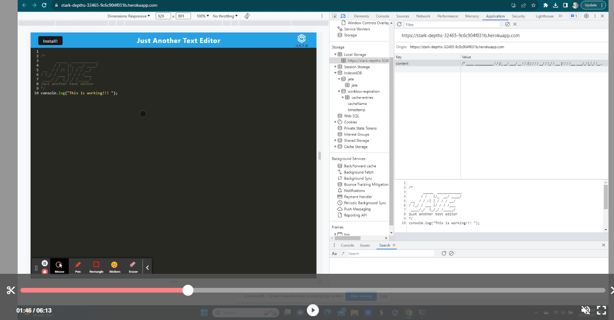

# Just Another Text Editor (J.A.T.E)

## Table of Contents

- [Description](#description) 
- [Installation](#installation)
- [Usage and Tests](#usage-and-tests)
- [Credits](#credits)
- [License](#license)

## Description

J.A.T.E is a Progressive Web Application (PWA) designed to provide users with a versatile and a rich text editor experience. My motivation behind building this project was to offer a modern and user-friendly text editor that could be accessed from any device with a web browser as well as be installable making it convenient for users to be offline and still create, edit, and save text documents. I have gained valuable experience by implementing offline functionality, and creating user-friendly interfaces and just how important it is to make my applications cross-platform compatible.

**Key Features:**

- Syntax highlighting for JavaScript, mainly.
- Installation as a standalone app on supported devices.
- User-friendly interface for efficient text editing.
- Accessibility: J.A.T.E can be used on any device with a web browser, making it accessible to a wide range of users.
- Offline Productivity: The offline support ensures that users can continue working on their text documents even when they are not connected to the internet.
- Cross-Platform: J.A.T.E is not limited to a specific operating system, allowing users to switch between devices seamlessly.

## Installation

[To use J.A.T.E, simply visit the website using a web browser](https://stark-depths-32465-9c6c904f031b.herokuapp.com). No installation is required since it is a Progressive Web Application (PWA). However, if you prefer to install it as a standalone app, follow these steps:

1. Open J.A.T.E in Google Chrome or another supported browser.
2. Click the Install button (the upper-left corner).
3. Click Yes to the Prompt.
4. You are done installing the JATE.

## Usage and Tests

[Watch Here how the App works](https://watch.screencastify.com/v/SW5kNcLWyA6Vrn1LUl0V)

1. Open the J.A.T.E app from your browser or the standalone installation.
2. Start typing or paste your text into the editor.
3. Don't worry about losing your text document, the app stores the data on its own.

- Testing the application

- jate database in IndexedDB and the storage

- The Manifest

- The Service WOrkers

## Credits

[Webpack Documentations](https://webpack.js.org/concepts/#entry)

[Service Worker](https://developer.mozilla.org/en-US/docs/Web/API/Service_Worker_API)

[Workbox Webpack Plugin](https://developer.chrome.com/docs/workbox/modules/workbox-webpack-plugin/)

[Choosing the right Caching Strategy](https://www.youtube.com/watch?v=ZCVgDKjtgl0)

**[Hafsah Nasreen](https://github.com/hafsah1976/PWA-Text-Editor)**

I would like to give credit to my instructors, and developers of libraries and tools that made this project possible. Additionally, I appreciate the open-source community for valuable resources and tutorials that helped me along the way.

## License

This project is licensed under the:

